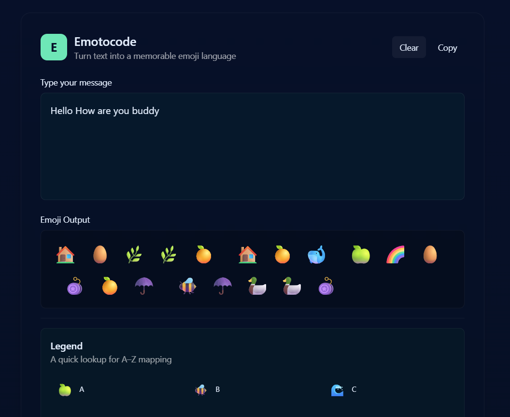

# Emotocode

[**Live Demo**](https://emotocode.vercel.app/) • A fun, minimalist way to turn your text into emojis 💬 ➡️ 🎨

---

##  What Is Emotocode?

Emotocode is a creative token language that converts letters (A–Z) into memorable emojis. It’s designed to be:
- **Visual & playful** – Turn your words into emoji sequences with meaning.
- **User-friendly & lightweight** – Instant conversion, copy, and download features.
- **Shareable** – Great for social bios, messages, or just for fun!

Built with **Next.js**, styled with **Tailwind CSS**, and enhanced with **Framer Motion** and **html2canvas**.

---

##  Features

-  **Real-time conversion** — Type text and instantly see the emoji output.
-  **Copy to clipboard** — One-click to copy your Emotocode for pasting anywhere.
-  **Interactive UI** — Hover effects and animations make it feel alive.
-  **Color-coded theme** — Dark, moody backdrop with mint & blue accents for contrast.

---

##  Usage Guide

1. Visit the live site: [https://emotocode.vercel.app/](https://emotocode.vercel.app/)  
2. Type your message into the input panel.  
3. Watch it auto-convert to emojis in the output pane.  
4. Click **Copy** to copy emojis to clipboard.

---

##  Tech Stack & Tools

- **Next.js** – Framework for server-rendered React apps.
- **Tailwind CSS** – Utility-first styling with dark-theme support.
- **Framer Motion** – Smooth emoji animations.
- **html2canvas** – Capture and export the emoji output area as PNG.
- **Vercel** – Instant deployment and hosting.

---

##  Inspiration & Applications

Emotocode can be used to:
- Create fun social media posts or bios in emoji form.
- Share secret "emoji codes" with friends.
- Engage in playful messaging where each letter is a visual token.
- Spark ideas for alternative writing systems or visual languages.

---

##  Future Enhancements

-  Expand mapping to include numbers & punctuation.
-  Add light/dark theme toggle or alternative emoji sets.
-  Allow SVG export for scalable sharing.
-  Add shareable links that store the original text in the URL.
-  Convert Emotocode to Text.

---

##  Contributing & Feedback

Feel free to fork this project, add your own emoji sets, UI improvements, or share on social media with #Emotocode — I’d love to see what you create!

---

By Rituraj Goswami -> Emotocode | Creative emoji token language